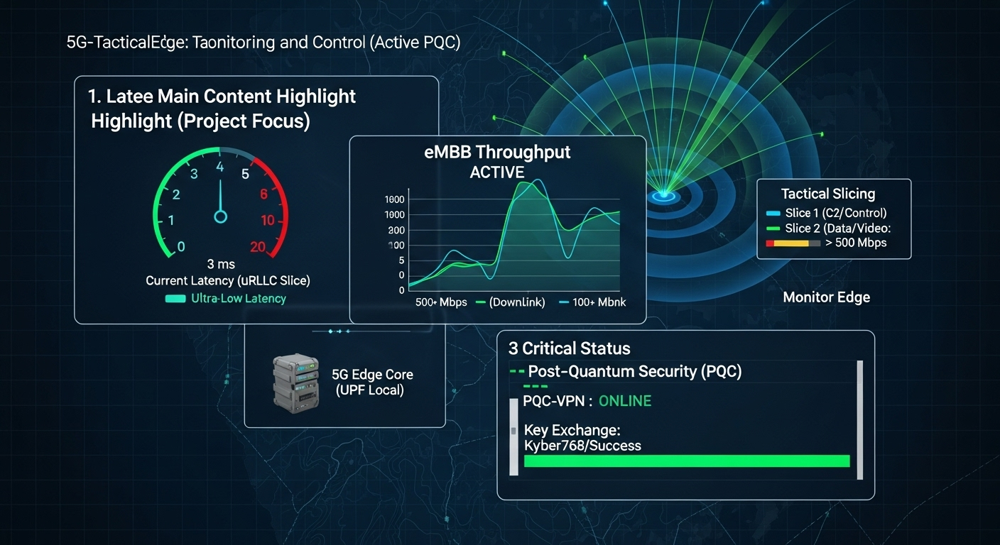
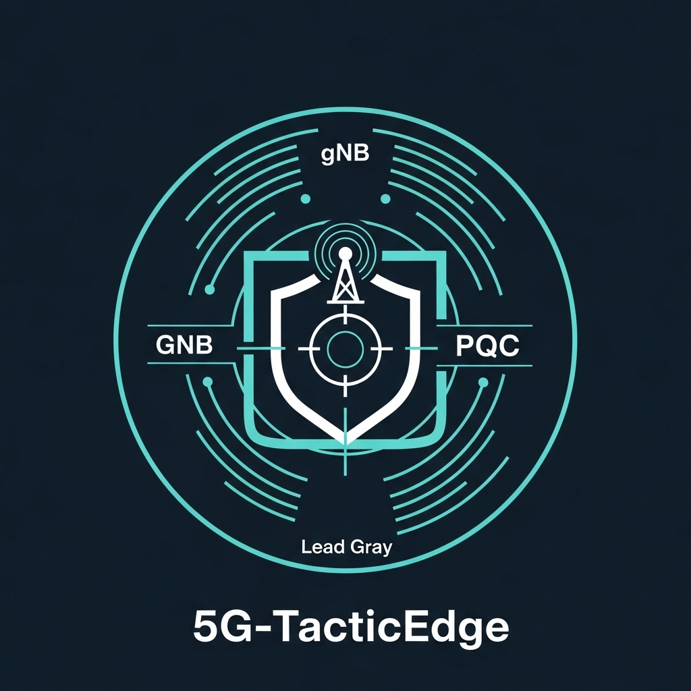
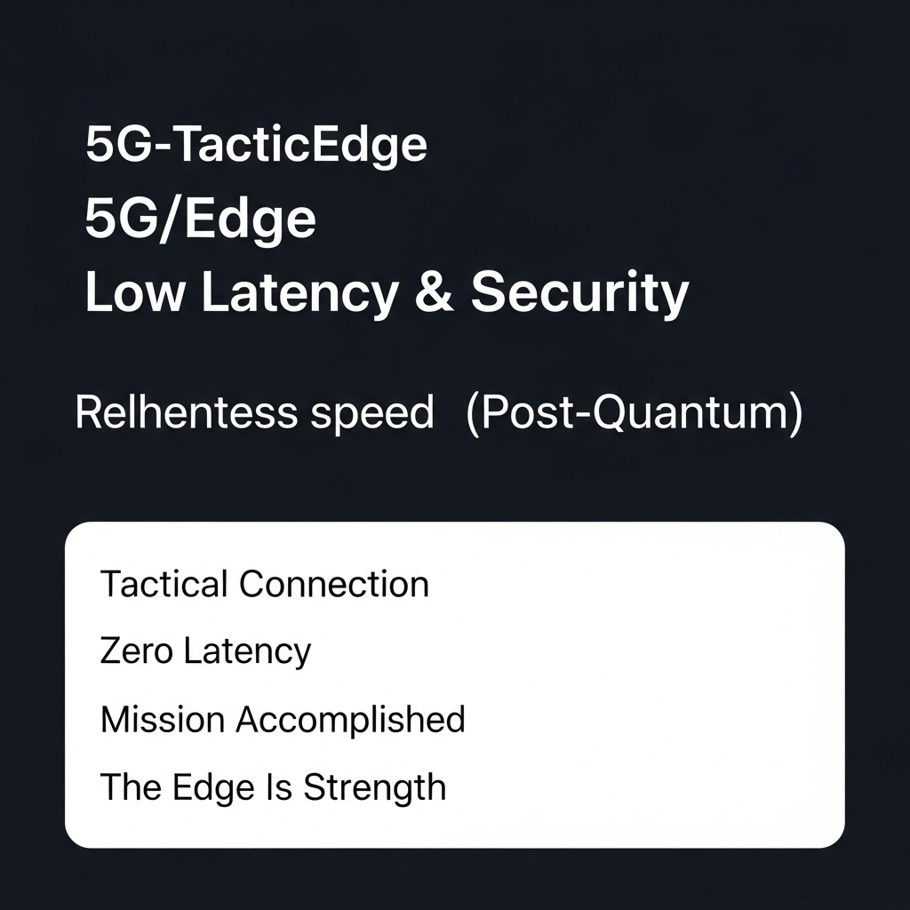

# 5G-TacticEdge: Rede 5G Privativa Tática de Borda (V1.0)

<p align="center">
  
</p>


  [](https://github.com/SovereignDefense)
  [](https://github.com/SovereignDefense/5GTacticEdge)
  [](https://open5gs.org/)
  [](https://pt.wikipedia.org/wiki/Criptografia_p%C3%B3s-qu%C3%A2ntica)
  [](https://pt.wikipedia.org/wiki/Soberania_digital)
  [](LICENSE)

## 🎯 Sumário Executivo

O **5G-TacticEdge** é um projeto de comunicação de defesa/segurança focado na implantação de uma Rede 5G Standalone (SA) de altíssima segurança e baixíssima latência na borda tática (Edge).

Esta Versão 1.0 representa o **Produto Viável Mínimo (PVM)**, com arquitetura definida, códigos de deploy funcionais (Docker Compose) e foco estratégico na segurança Pós-Quântica (PQC), pronto para testes de funcionalidade em laboratório (Proof of Concept).

---

<p align="center">
  
</p>

---

## 📁 Estrutura do Repositório (PVM)

O repositório está estruturado para permitir apresentação imediata e testes técnicos do Edge Core:

| Arquivo | Conteúdo | Propósito Principal |
| :--- | :--- | :--- |
| `LICENSE` | **O texto completo da Apache License 2.0.** | **Blindagem Legal** e termos de uso. |
| `index.html` | Website completo do projeto (Código Único). | **Apresentação Visual** e documentação de alto nível. |
| `PROJECT_PLAN.md` | Detalhamento da Arquitetura, Componentes e KRIs. | **Documento Formal** para gestão e engenharia. |
| `CORE_SETUP_GUIDE.md` | Guia de implementação do 5G Edge Core (Docker/Open5GS). | **Referência Técnica** para instalação em campo. |
| **`docker-compose.yaml`**| Código funcional para iniciar o 5G Edge Core. | **Coração do PVM** (Edge Core Network Functionality). |
| **`deploy.sh`** | Script de shell para deploy rápido e teste de conectividade do Core. | **Teste de Funcionalidade** (MVP Validation). |
| `README.md` | (Este arquivo) | Ponto de partida, sumário e instruções. |

<p align="center">
  
</p>

Este guia detalha os passos para a implantação do Core Network 5G na borda (Edge Core Appliance) usando Open5GS e Docker.

## 1. Pré-Requisitos no Edge Core Appliance

O Appliance deve rodar uma distribuição Linux (ex: Ubuntu Server 22.04 LTS).

1.  **Instalar Docker e Docker Compose:**
    ```bash
    sudo apt update
    sudo apt install docker.io docker-compose -y
    sudo usermod -aG docker $USER
    # Reinicie a sessão
    ```
2.  **Configurar IP e Rotas:**
    O Edge Core Appliance deve ter IPs estáticos para o gNB (Front-haul) e para o Backhaul.
    * Exemplo de interface UPF (User Plane Function) que se conecta ao gNB: `10.45.0.1/16`

## 2. Implantação do Core Network (Open5GS)

Utilizaremos o Docker Compose para subir as funções mínimas do 5G Core.

1.  **Criar o Diretório do Projeto:**
    ```bash
    mkdir 5G-TacticEdge-Core
    cd 5G-TacticEdge-Core
    git clone [https://github.com/SovereignDefense/5GTacticEdge.git](https://github.com/SovereignDefense/5GTacticEdge.git)
    ```
    *Continue a implantação seguindo o guia detalhado em `CORE_SETUP_GUIDE.md`.*

## 🚀 Visão Geral e Arquitetura

### 1. Visão Geral do Projeto

**Título:** Rede 5G Privativa Tática de Borda (Ultra-Low Latency & PQC-Ready)
**Objetivo:** Prover uma solução de comunicação 5G Standalone (SA) independente, ultrarrápida (baixa latência) e criptograficamente robusta (pós-quântica habilitada) para operações de Comando e Controle (C2) e unidades de campo.

### 2. Arquitetura da Rede (5G Standalone Edge Core)

O 5G-TacticEdge emprega uma arquitetura **Non-Public Network (NPN) Standalone (SA)**, onde o Core Network é descentralizado para a borda.

#### 2.1. Componentes Físicos (Hardware Mínimo Necessário)
| Componente | Função | Requisito Técnico Mínimo |
| :--- | :--- | :--- |
| **Edge Core Appliance (Mini-PC Tático)** | Hospeda o 5G Core (AMF, SMF, UPF) e o VPN Gateway. | CPU i5/i7 (8ª geração ou superior), 32GB RAM, SSD NVMe 512GB, Conexão 10GbE. |
| **gNB (Rádio Tático)** | Estação Rádio Base 5G/LTE para acesso de campo. | SDR (USRP) ou Small Cell industrial com capacidade para faixas CBRS/n78. |
| **Backhaul Tático** | Link de longa distância para o Ponto de Comando Principal (se aplicável). | Satélite (Starlink Tático/GEO) ou Rádio Ponto-a-Ponto (PTP) de alta capacidade. |
| **Dispositivo de Usuário (UE)** | Rádios 5G *Rugged* ou modems embarcados em veículos/sensores. | Modem 5G NR (New Radio) compatível com a banda do gNB e IPsec. |

#### 2.2. Funções de Rede (Software - Dockerizado)
| Função | Módulo de Software (Open Source Recomendado) | Detalhe Funcional |
| :--- | :--- | :--- |
| **5G Core** | Open5GS ou srsRAN Project | Implementa AMF, SMF, UPF (Data Plane na Borda para latência $\le 5\text{ms}$). |
| **VPN / PQC Gateway**| Libreswan (com Open Quantum Safe - OQS) | Cria túneis IPsec de camada 3 com algoritmos Pós-Quânticos. |
| **Orquestração** | Docker Compose / Kubernetes K3s | Gerenciamento leve do ciclo de vida dos containers no Edge Core Appliance. |

## 3. Requisitos de Desempenho Crítico (KRIs)

| Requisito | Valor Alvo | Impacto Tático |
| :--- | :--- | :--- |
| **Latência (RTT)** | **< 5 ms** | Suporte a aplicações de tempo real (Controle de Robôs, Realidade Aumentada). |
| **Vazão de Pico (eMBB)** | **> 500 Mbps** | Transmissão simultânea de dados de sensor e vídeo em alta definição. |
| **Segurança** | **Pós-Quântica Híbrida**| Garante confidencialidade a longo prazo, mesmo contra ataques quânticos. |
| **Soberania** | **100% Standalone (SA)**| Não dependência de infraestrutura civil ou de terceiros. |

## 4. Segurança Criptográfica (PQC-Ready)

A camada de segurança mais crítica é o *VPN Gateway*. Utilizamos um protocolo IPsec estendido para incorporar algoritmos resistentes à computação quântica (PQC), garantindo que a rede não seja vulnerável à técnica **"Store Now, Decrypt Later" (SNDL)**.

* **Troca de Chaves (Key Exchange):** Híbrido Kyber-768 / Curve25519.
* **Assinatura Digital (Authentication):** Dilithium-3 / ECDSA.

---


## 🛡️ Licença

**Copyright (c) 2025 MATEUS SILVA DOS SANTOS**

Este projeto é totalmente Open Source e é regido pelos termos da **Apache License, Version 2.0**.

1.  **Exoneração Total de Responsabilidade (AS IS):** O software é fornecido sem garantias ou condições de qualquer tipo, protegendo o autor de processos por danos ou mau funcionamento.
2.  **Concessão de Patente Explícita:** Qualquer contribuidor concede uma licença de uso para as patentes que seu código possa conter, protegendo o projeto de litígios de Propriedade Intelectual (PI).

**Termos Completos:**
Consulte o arquivo [LICENSE](LICENSE) na raiz do repositório para os termos completos.

## 💻 Desenvolvido por

**MATEUS SILVA DOS SANTOS**

[](https://github.com/MateusWorkSpace)